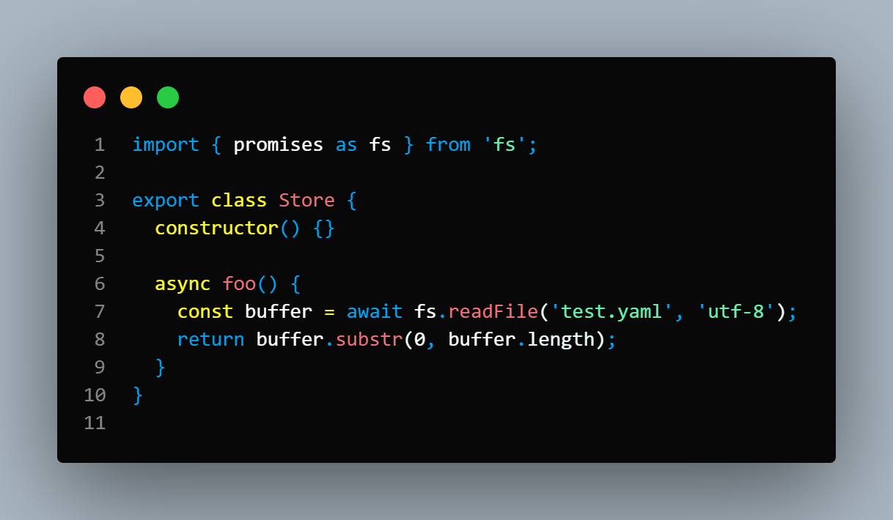
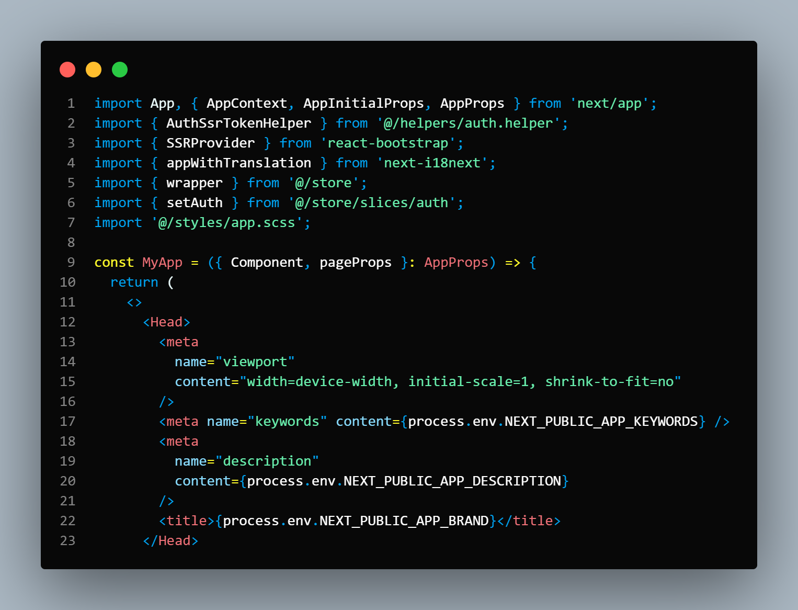
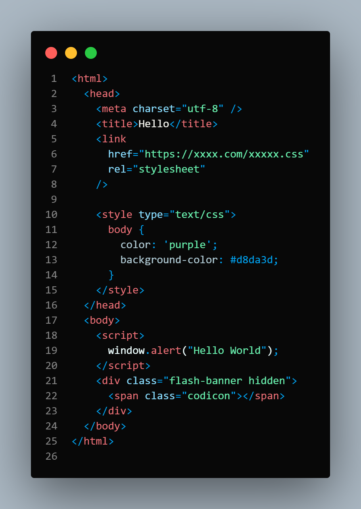

# Black Matter Theme

## Installation

1. Open the **Extensions** sidebar in VS Code. `View → Extensions`
1. Search for `Black Matter Theme`, choose "Black Matter Theme"
1. Click **Install** to install it
1. Navigate to File > Preferences > Color Theme > **Black Matter Theme**

## Manual Installation

Clone the repository into `~/.vscode/extensions` and restart the editor.

## Screenshots

### JS

### JSX

### HTML

